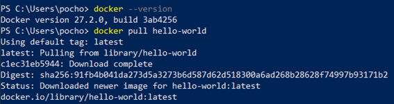
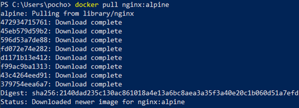
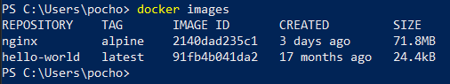
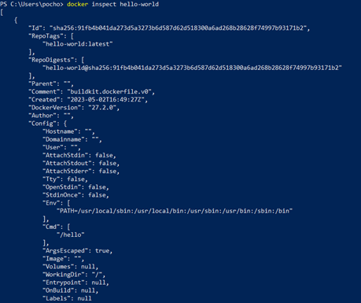
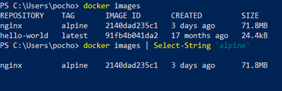
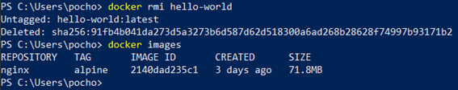
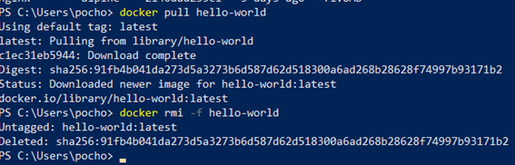

# Imagen
Es un archivo único que contiene todos los programas, librerías, dependencias y configuraciones necesarias para instalar y/o ejecutar una aplicación o un conjunto de aplicaciones.


## ¿Cuál es la relación entre una imagen y un contenedor?
Una imagen contiene diferentes elementos los cuales son necesarios para la ejecución de una aplicación. Lo que se hace en el contenedor es crear una instancia de ejecución en la cual se va a cargar la imagen dado que a partir de una imagen podemos crear diferentes contenedores. En conclusión, el contenedor es una instancia que se crea a partir de una imagen en la cual podemos realizar la ejecución de la aplicación.
# COMPLETAR 


## Comandos para imágenes

### Descargar imagen
Descarga la última versión de la imagen disponible en el registro de Docker.

```
docker pull <nombre imagen> 
```

Descarga una versión específica de la imagen, cada imagen tiene etiquetas (tags) para diferentes versiones.
Una imagen puede tener la etiqueta latest para representar la última versión, si no se especifica una etiqueta se hará referencia a la versión latest.

```
docker pull <nombre imagen>:<tag>
```

Descargar la imagen **hello-world**


# COMPLETAR

**¿Qué es nginx**

Es un servidor web que también puede funcionar como proxy inverso al reenviar solicitudes a otros servidores, balanceador de carga o proxy de correo. Su función en relación con Docker se da con el proxy inverso, ya que puede encargarse del reenvío de solicitudes hacia otros contenedores, siendo entonces el encargado del reenvío de las solicitudes de los usuarios. 
# COMPLETAR 

Descargar la imagen  **nginx** en la versión **alpine**


# COMPLETAR

### Listar imágenes

```
docker images
```


# COLOCAR UNA CAPTURA DE PANTALLA DEL RESULTADO 

**Identificadores**

En Docker, se utilizan varios identificadores para diferenciar de manera única los elementos del sistema, como imágenes, contenedores, volúmenes y redes. Estos identificadores son generados automáticamente por Docker y son únicos dentro del contexto del sistema Docker en el que se encuentran. 

### Inspeccionar una imagen
El comando docker inspect se utiliza para obtener información detallada sobre un objeto de Docker específico, como un contenedor, una imagen, un volumen o una red.  Proporciona información en formato JSON sobre el objeto especificado.

```
docker inspect <nombre imagen>
docker inspect <nombre imagen>:<tag>
```

Inspeccionar la imagen hello-world 


# COMPLETAR

**¿Con qué algoritmo se está generando el ID de la imagen**

Se está utilizando el algoritmo de encriptación SHA-256, el cual se utiliza para transformar datos en una cadena de caracteres de 256 bits. Dado que se genera un id único, sirve para identificar a las diferentes imágenes de forma muy precisa. 
# COMPLETAR

### Filtrar imágenes

```
docker images | grep <termino a buscar>

```


### Para eliminar una imagen
Eliminar permanentemente la imagen de tu sistema Docker.

```
docker rmi <nombre imagen>:<tag>
```

Eliminar la imagen hello-world 


# COMPLETAR

-f: Es la opción para forzar la eliminación de la imagen incluso si hay contenedores en ejecución que utilizan esa imagen.
Cuando eliminas una imagen Docker, Docker no elimina automáticamente los contenedores que se han creado a partir de esa imagen. Esto significa que, aunque hayas eliminado la imagen, el contenedor seguirá ejecutándose normalmente.  
**Considerar**
Eliminar una imagen no afecta a los contenedores que se han creado a partir de esa imagen, a menos que esos contenedores dependan de archivos o configuraciones específicas de la imagen eliminada. En ese caso, es posible que los contenedores se comporten de manera inesperada después de eliminar la imagen.
Es una buena práctica detener y eliminar todos los contenedores que dependan de una imagen antes de eliminar la imagen en sí.

```
docker rmi -f <nombre imagen>:<tag>
```


